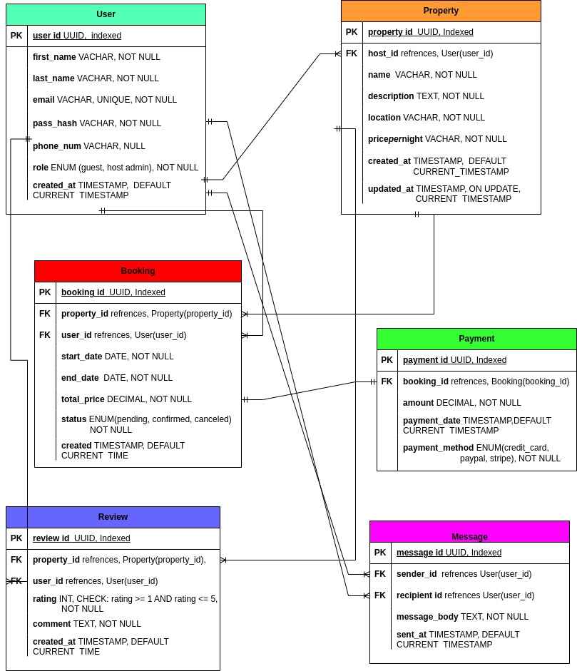

# Entity-Relationship Diagram (ERD)

This ERD models the core entities and relationships of an Airbnb-like application. It was created using Draw.io and follows proper normalization principles.

## 📌 Diagram

## ✅ Key Entities and Relationships

- **User** can be a guest, host, or admin.
- **User ↔ Property**: A host can own multiple properties.
- **User ↔ Booking**: A guest can make multiple bookings.
- **Property ↔ Booking**: A property can have multiple bookings.
- **Booking ↔ Payment**: One booking has one payment.
- **User ↔ Review**: A guest can write multiple reviews.
- **Property ↔ Review**: A property can have many reviews.
- **User ↔ Message**: Users can send and receive multiple messages.

All foreign key constraints and normalization up to 3NF have been respected.

---

**Diagram generated on:** `May 5, 2025`  
**Tool used:** [Draw.io](https://app.diagrams.net/)

## 🗄️ Database Specification

### 🧩 Entities and Attributes

#### 👤 User
| Attribute        | Type                           | Constraints                                      |
|------------------|--------------------------------|--------------------------------------------------|
| `user_id`        | UUID                           | Primary Key, Indexed                             |
| `first_name`     | VARCHAR                        | NOT NULL                                         |
| `last_name`      | VARCHAR                        | NOT NULL                                         |
| `email`          | VARCHAR                        | UNIQUE, NOT NULL                                 |
| `password_hash`  | VARCHAR                        | NOT NULL                                         |
| `phone_number`   | VARCHAR                        | NULLABLE                                         |
| `role`           | ENUM (guest, host, admin)      | NOT NULL                                         |
| `created_at`     | TIMESTAMP                      | DEFAULT CURRENT_TIMESTAMP                        |

> **Constraint**: Unique email, and non-null required fields.

---

#### 🏡 Property
| Attribute        | Type                           | Constraints                                      |
|------------------|--------------------------------|--------------------------------------------------|
| `property_id`    | UUID                           | Primary Key, Indexed                             |
| `host_id`        | UUID                           | Foreign Key → `User(user_id)`                    |
| `name`           | VARCHAR                        | NOT NULL                                         |
| `description`    | TEXT                           | NOT NULL                                         |
| `location`       | VARCHAR                        | NOT NULL                                         |
| `pricepernight`  | DECIMAL                        | NOT NULL                                         |
| `created_at`     | TIMESTAMP                      | DEFAULT CURRENT_TIMESTAMP                        |
| `updated_at`     | TIMESTAMP                      | ON UPDATE CURRENT_TIMESTAMP                      |

> **Constraint**: Foreign key on `host_id`. All fields are NOT NULL where required.

---

#### 📅 Booking
| Attribute        | Type                           | Constraints                                      |
|------------------|--------------------------------|--------------------------------------------------|
| `booking_id`     | UUID                           | Primary Key, Indexed                             |
| `property_id`    | UUID                           | Foreign Key → `Property(property_id)`            |
| `user_id`        | UUID                           | Foreign Key → `User(user_id)`                    |
| `start_date`     | DATE                           | NOT NULL                                         |
| `end_date`       | DATE                           | NOT NULL                                         |
| `total_price`    | DECIMAL                        | NOT NULL                                         |
| `status`         | ENUM (pending, confirmed, canceled) | NOT NULL                                    |
| `created_at`     | TIMESTAMP                      | DEFAULT CURRENT_TIMESTAMP                        |

> **Constraint**: Foreign keys on `property_id`, `user_id`. `status` must be one of the defined values.

---

#### 💳 Payment
| Attribute        | Type                           | Constraints                                      |
|------------------|--------------------------------|--------------------------------------------------|
| `payment_id`     | UUID                           | Primary Key, Indexed                             |
| `booking_id`     | UUID                           | Foreign Key → `Booking(booking_id)`              |
| `amount`         | DECIMAL                        | NOT NULL                                         |
| `payment_date`   | TIMESTAMP                      | DEFAULT CURRENT_TIMESTAMP                        |
| `payment_method` | ENUM (credit_card, paypal, stripe) | NOT NULL                                     |

> **Constraint**: Valid foreign key to a `Booking`. Secure payment method ENUM.

---

#### 🌟 Review
| Attribute        | Type                           | Constraints                                      |
|------------------|--------------------------------|--------------------------------------------------|
| `review_id`      | UUID                           | Primary Key, Indexed                             |
| `property_id`    | UUID                           | Foreign Key → `Property(property_id)`            |
| `user_id`        | UUID                           | Foreign Key → `User(user_id)`                    |
| `rating`         | INTEGER                        | CHECK: `rating >= 1 AND rating <= 5`, NOT NULL   |
| `comment`        | TEXT                           | NOT NULL                                         |
| `created_at`     | TIMESTAMP                      | DEFAULT CURRENT_TIMESTAMP                        |

> **Constraint**: Rating must be between 1–5. Valid property/user references.

---

#### ✉️ Message
| Attribute        | Type                           | Constraints                                      |
|------------------|--------------------------------|--------------------------------------------------|
| `message_id`     | UUID                           | Primary Key, Indexed                             |
| `sender_id`      | UUID                           | Foreign Key → `User(user_id)`                    |
| `recipient_id`   | UUID                           | Foreign Key → `User(user_id)`                    |
| `message_body`   | TEXT                           | NOT NULL                                         |
| `sent_at`        | TIMESTAMP                      | DEFAULT CURRENT_TIMESTAMP                        |

> **Constraint**: Foreign keys to valid sender and recipient users.

---

### 🔍 Indexing Strategy
| Table            | Indexed Fields                         |
|------------------|----------------------------------------|
| `User`           | `user_id` (PK), `email` (UNIQUE)       |
| `Property`       | `property_id` (PK), `host_id`          |
| `Booking`        | `booking_id` (PK), `property_id`, `user_id` |
| `Payment`        | `payment_id` (PK), `booking_id`        |
| `Review`         | `review_id` (PK), `property_id`, `user_id` |
| `Message`        | `message_id` (PK), `sender_id`, `recipient_id` |

---

### 📌 Summary of Constraints

- **Unique Constraints**: `User.email`
- **Foreign Keys**:
  - `Property.host_id → User.user_id`
  - `Booking.property_id → Property.property_id`
  - `Booking.user_id → User.user_id`
  - `Payment.booking_id → Booking.booking_id`
  - `Review.property_id → Property.property_id`
  - `Review.user_id → User.user_id`
  - `Message.sender_id` & `recipient_id → User.user_id`
- **Checks**:
  - `Review.rating`: Must be between 1 and 5
  - `Booking.status`: Must be `pending`, `confirmed`, or `canceled`

---

